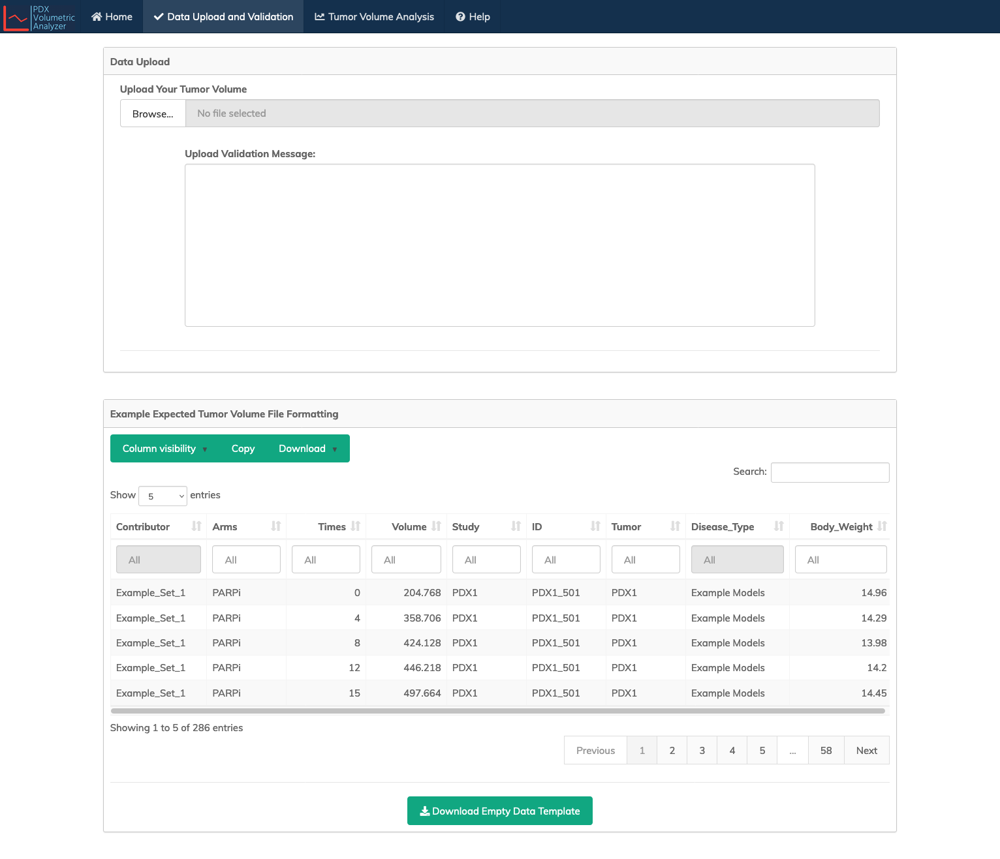
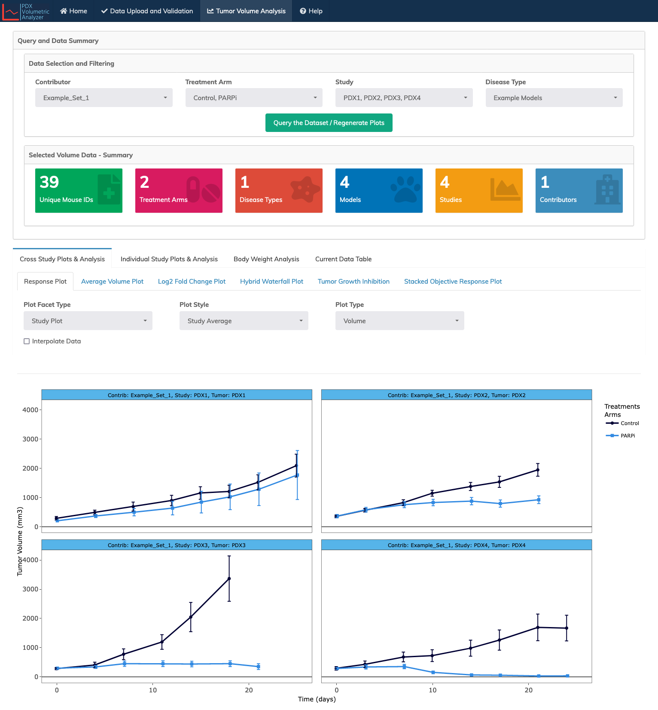
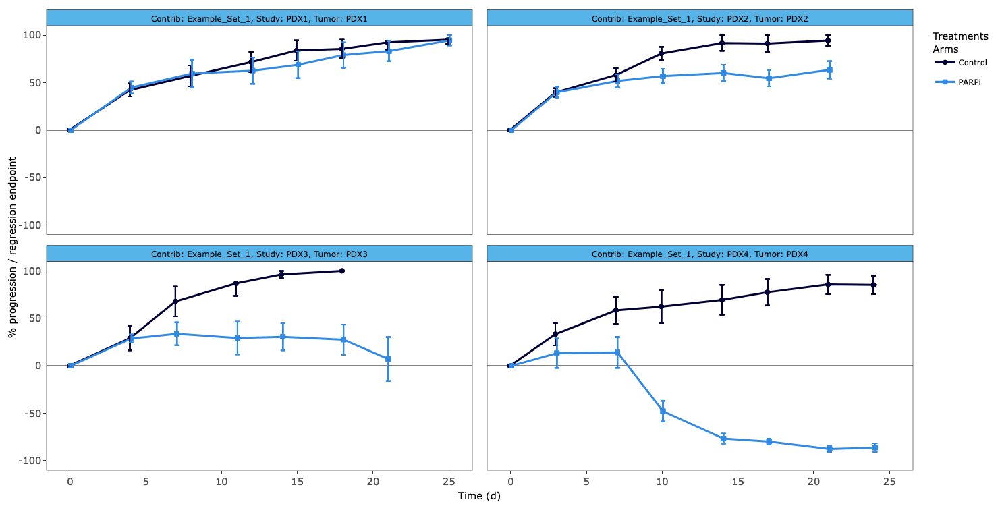
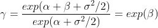
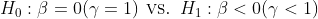
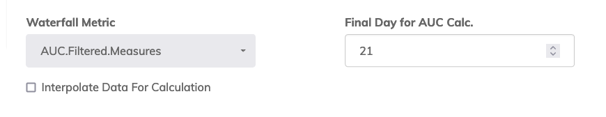
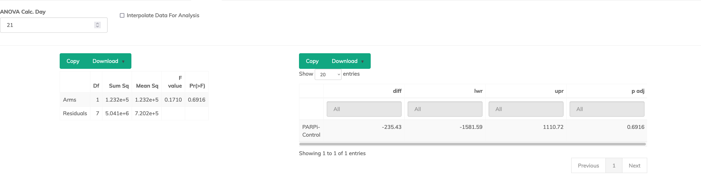

# Tumor Volume Analysis Suite

  

From the splash page, or via the top menu users can access "Data Upload and Validation" or "Tumor Volume Analysis." 

## Data Upload and Validation

On this tab, you can upload your tumor volume data by clicking the 'browse' button and then selecting your file. Files are expected in either CSV or EXCEL format. Other formats are not accepted.  

Files uploaded to this tool must also contain expected columns and data structure as described in the following section: 

---

### Data Format and Structure

The following columns with the **exact names** and **data types** are expected in the dataset uploaded to the tool. 

    1. 'Contributor':  

        Attributes studies to the contributing investigator or institution (e.g., PDTC_1, PDTC_2).  

    2. 'Arms':

        Treatment arms description (e.g., Carboplatin, Control).  
        NOTE: The dataset MUST contain a control arm, and the control arm MUST be named 'Control'. 
              An error will be thrown on upload if the text 'Control' is missing from the treatment arm column.   

    3. 'Times':  

        Numeric study day (e.g., 0, 4, 8, 14, 21).
        NOTE: Numeric or integer values are expected. Calendar dates (e.g., 06.02.2022) are not valid.   

    4. 'Volume':  
    
        Tumor volume in mm3 (e.g. 200, 140, 23.4). 
        NOTE: Negative values are accepted, but may result in improper plotting or calculations. 
        A warning message from the validator will report the number of values with negative volumes. 

    5. 'Study':  
    
        Study ID corresponding to that particular sample (e.g., Study_1, Study_2).  

    6. 'ID':  
    
        Unique identifier for each individual animal on study (e.g., Mouse_1, Mouse_2).
        NOTE: Animal IDs MUST be unique across studies. 

    7. 'Tumor':  
    
        PDX model ID (e.g., PDX_1, PDX_2).   

    8. 'Disease_Type':  
    
        A descriptor of the tumor type (e.g., Invasive breast carcinoma, Unknown, NA). 
        NOTE: This is a free text field, and is only used in the data filter query.
    
    9. 'Body_Weight': 

        The measured body weights of the animals (e.g., 14.2, 14, 15.1). 
        NOTE: This field is optional, if not provided the 'Body Weight Analysis' tab will be disabled.  

### Upload Validation Message: 

Once you file is selected, a validator will run during the upload to ensure that all fields are present, and that each field contains the expected data type. 

If data are correctly formatted, a message 'Successfully Validated Your Tumor Volume Data!' will show that you successfully imported and loaded your data to the 'Tumor Volume Analysis' tab.  

If data are improperly formatted, the validator will list errors associated with the upload. Correct the errors in your local file, and retry the upload. 

### Example Expected Tumor Volume File Formatting

An example data table is provided on this page to show users the expected data structure and formatting. This table can be download for your reference. 

## Tumor Volume Analysis

The Tumor Volume Analysis page contains all plot and analysis functions.  

  

By default an example dataset is loaded. To add your own data, see the **Data Upload and Validation** section of this document. 

---

> **NOTE:** For many plots and metrics, a user defined time point is required for the calculation (e.g., RECIST objective response classification). In these cases, measures are calculated based on data sampled from the last available time point for each individual (rounded down). 
>
> **Example:**   
> Tumors for a study are measured at time points 0, 7, 10, 21, 29.   
> 1. If a user selects to calculate RECIST classification at time 21; data from time point 21 will be used.   
> 2. If a user selects to calculate RECIST at time 26; data at time 21 will also be used.
> 
> 3. If data are collected in an asynchronous fashion, (e.g., mouse_1: 0, 7, 10; mouse_2: 0, 6, 9, etc.), the last available time point (rounded down) for each individual animal is used.
> 
> In all cases where a user must input a day for calculation, data underlying the metric or plot can be interpolated as described below. Using interpolation overcomes asynchronous and missing data issues. Note that the use of interpolation should be reported in final results.
> 
> Ultimately, it is up to the user to know their data and select time points for metric calculation that are relevant to the data. 

---

### Interpolation 

In all cases where a user must input a day for calculation (plots and metrics), data underlying the metrics can be interpolated using the 'Interpolate Data' or 'Interpolate Data for Calculation' checkboxes. 

When these boxes are checked, a linear interpolation method is used to adjusts for animals where there is no tumor volume measurement at time *t*, but which have flanking volume measurements at time *t*0 and *t*1 such that *t*0 < *t* < *t*1.

### Query and Data Summary

#### Data Selection and Filtering

This section contains data query filters, which allows the user to select subsets of the loaded data set. For example, select which treatment arms you wish to visualize. 

**NOTE:** When selecting treatment arms, 'Control' **MUST** be selected, or plots and analysis metrics will not be generated. Likewise, if no data is selected, the tool will not function. 

--- 

#### Selected Volume Data - Summary

This section summarized the selected data. The number of unique mouse IDs, treatment arms, disease types, models, studies, and contributors are shown. 

## Tumor Volume Analysis Pages

Below the data query and summary are three sub-tabs that allow users to access different plots and the filtered data table. 

1. Cross Study Plots and Analysis
2. Individual Study Plots & Analysis
3. Body Weight Analysis (if body weights provided)
4. Current Data Table

---

### 1. Cross Study Plots and Analysis

The user selects from six tabs that provide access to different visualizations and analysis metrics for cross study comparisons. 

**NOTE:** Data filtering via 'Data Selection and Filtering' dropdowns can be used to select or deselect studies as needed.

  

**Individual plots and options are described below.**

---

#### 1a. Response Plot

  

A common way to display tumor growth on treatment and control arms are tumor growth curves, which typically displays tumor volumes calculated by the following formula:  

Tumor growth curves in this panel are by default as the 'Study Average' of tumor volume with standard errors. 

* Plots are arranged by 'Study' (default) or 'Treatment' using the 'Plot Facet Type' dropdown.  

* Plots can also be shown by 'Study Average' (default) or 'Individual Animal' using the 'Plot Style' dropdown. 

* Data for all plot combinations / selection can be interpolated with 'Interpolate Data'

* There are four options for 'Plot Type' with that dropdown. The options are:   

---

A. Volume (default)

This plot displays tumor volume as provided by the user in the 'Volume' column of the loaded/filtered dataset. It is assumed that this is tumor volume in mm3.

---

B. Scaled  

  

This plot re-scales volume data from -100 to 100. Where -100 represents total tumor regression, 0 is neither growth nor regression, and 100 represents when growth has reached a pre-defined end point. 

Users are able to define the endpoint as either a growth factor (e.g., 4x) or volume (e.g., 1200 mm3). When 'Scaled' is selected, the 'Scale Plot By' and 'Endpoint Scaling' options will appear. 

 

---
  
C. Percent Change  

  

This plot shows an alternate way to demonstrate growth curves using percent change in tumor volume. Percent change is defined for each individual within study and treatment arm. It is calculated as follows: 

---

D. Semi-Log  

 

This plot show the natural logarithm transformation of volume measures on the y-axis, and study day along the x-axis.

---

#### 1b. Average Volume Plot

 

This plot shows cross study average volume across all animals for treatment arms +/- SE at a user defined time point (default "Avg Measure Calc. Day" is 21). Data underlying this plot can be interpolated with the checkbox.  

#### 1c. Log2 Fold Change Plot

 

This plot shows cross study mean log2 fold change [log2(Volumet / Volumet)] across all animals for treatment arms +/- SE across all measurement time points. Data underlying this plot can be interpolated with the checkbox.  

---

#### 1d. Hybrid Waterfall Plot

 

This plot shows cross study hybrid waterfall plot. Where model by treatment arm shows progression, T / C ratio +/- SE  is displayed in the plot. T/C is defined within study, tumor, and treatment arm defined roughly as:  

For the specific formulation, see the 'Tumor Growth Inhibition' section that follows. 

Where model by treatment arm shows regression, percent change in tumor volume (as defined above) +/- SE is shown. The calculation of these metrics is taken at the user defined time point (default "Waterfall Calc. Day" is 21). Data underlying this plot can be interpolated with the checkbox.
  

---

#### 1e. Tumor Growth Inhibition

 

This plot and table shows cross study tumor growth inhibition defined as the T/C ratio at the user defined time point (default "TGI Calc. Day" is 21). 

To measure antitumor activity of the treatment group compared to the control group, we considered the tumor growth treatment-to-control ratio (gammat) estimated by one way ANOVA focused on time *t* as described in Supplemental Materials 1 in (Evrard et al. 2020). Data underlying this plot can be interpolated with the checkbox.  

 
Briefly, after log transforming the change in tumor volume (as defined above), a linear model is fit:

where *Ti* is the treatment arm for each individual. 

If we define TGI as the ratio of mean tumor to mean control as in the equation shown in section 1c. above, it can be shown that:

Where TGI < 1 indicates the degree of growth inhibition of the treatment relative to control. To test for the significance of anti-tumor activity of the treatment group at time *t*, we test the null hypothesis of no treatment effect by comparing:

    Evrard YA, Srivastava A, Randjelovic J, Doroshow JH, Dean DA 2nd, Morris JS, Chuang JH; NCI PDXNet Consortium. Systematic Establishment of Robustness and Standards in Patient-Derived Xenograft Experiments and Analysis. Cancer Res. 2020 Jun 1;80(11):2286-2297. doi: 10.1158/0008-5472.CAN-19-3101. Epub 2020 Mar 9. PMID: 32152150; PMCID: PMC7272270.

---

#### 1f. Stacked Objective Response Plot

 

This plot summarizes individual animal objective response criteria at the user defined time point (default "RECIST Calc. Day" is 21). Data underlying this plot can be interpolated with the checkbox.  

The classification used mimics RECIST criteria commonly used in clinical trials for solid tumors to classify each patient as complete response (CR), partial response (PR), stable disease (SD), or progressive disease (PD). At a user defined time *t*, each animal was classified into one of these four categories based on their percent tumor volume change from baseline based on the following cut points: 

1. CR : ∆TVt <= -95%
2. PR : -95% < ∆TVt <= -30%
3. SD : -30% < ∆TVt <= 20%
4. PD : All other cases

---

### 2. Individual Study Plots & Analysis

Users select the 'Study' of interest from the study selection dropdown. Four sub-tabs provide access to different visualizations and analysis metrics for analysis of the selected study. 

#### 2a. Objective Response (RECIST)

 

This plot and table summarize cohort level objective response criteria at the user defined time point (default "RECIST Calc. Day" is 21). Data underlying this metric can be interpolated with the checkbox.  

The classification used mimics RECIST criteria commonly used in clinical trials for solid tumors to classify each patient as complete response (CR), partial response (PR), stable disease (SD), or progressive disease (PD). This classification differs from the above, in that a RECIST classification is applied to each treatment arm in the following way. 

1. ∆TV for each animal is calculated at time *t*.
2. Within each treatment arm, the minimum ∆TV is found as ∆TVm.
3. Within each treatment arm, the mean ∆TV is computed across replicates as ∆TVa.
3. RECIST category is then determined for each treatment arm as follows:  
    1. CR : ∆TVm <= -95%, and  ∆TVa <= -40%
    2. PR : ∆TVm <= -50%, and  ∆TVa <= -20%
    3. SD : ∆TVm <=  35%, and  ∆TVa <=  30%
    4. PD : All other cases

#### 2b. Waterfall Plot

 

Waterfall plots can be shown for individual animals using one of three different metrics selected in the 'Waterfall Metric' dropdown.

1. dVt : percent change in tumor volume. 
2. AUC.All.Measures : Area under the curve for the entire time series. 
3. AUC.Filtered.Measures : Area under the curve for the time series up through the user specified day (default "Final Day for AUC Calc." is 21). Note that "Final Day for AUC Calc." will only be present when AUC.Filtered.Measures is selected. 

 

Area under the tumor growth curve from baseline up to time *t* (either max time, or user specific time) is normalized by dividing by *t*. With this normalization factor, the interpretation of this measure is the average percent change in tumor size from baseline to time *t*. For area under a spline interpolation was used (`splinefun` function in combination with `integrate` to calculate a numerical integral). All three measures can be computed from interpolated data using the checkbox. 

#### 2c. Event Free Survival

 

Event free survival analysis is conducted based on censoring events which occur when tumor growth exceeds the user defined percent change in volume. By default the "Event Size: Percent Change in Volume" is 100% which represents 2x tumor growth (200% would represents 4x growth etc). EFS is censored at the last measurement for animals whose tumors do not reach the defined threshold. The survival curve estimates and significance for the censored data is computed using the Kaplan-Meier method in the `survfit` package. Median survival is shown as a dotted line. Data underlying this metric/plot can be interpolated with the checkbox.

---

#### 2d. ANOVA

 

The difference in tumor volumes among treatment arms at a user defined day can be compared using one-way ANOVA. By default ANOVA Calc. Day is 21 days. If at the user defined day, fewer than 2 groups exists, and error message will be displayed. If this occurs select a different time point. When the number of treatment arms is two or more, a multiple mean comparison test (Tukey) is provided to compare treatment arms against control.

---

### 3. Body Weight Analysis

 

PDX experiments should include monitoring of body weight and overall health as toxicity analogs. Antitumor activity is only clinically relevant if it can be achieved without substantial toxicity.

When provided with body weight data, users can select the 'Body Weight Analysis' tab to display body eight plots. Body weight curves in this panel are by default as the 'Study Average' of weight with standard errors. 

* Plots are arranged by 'Study' (default) or 'Treatment' using the 'Plot Facet Type' dropdown.  

* Plots can also be shown by 'Study Average' (default) or 'Individual Animal' using the 'Plot Style' dropdown. 

* Data for all plot combinations / selection can be interpolated with 'Interpolate Data'

* There are two options for 'Plot Type' with that dropdown. The options are:   

---

A. Weight (default)

This plot displays body weight as provided by the user in 'Body_Weight' column of the loaded/filtered dataset. 

----

B. Percent Change  

  

This plot shows an alternate way to demonstrate body weight curves using percent change in body weight. Percent change is defined for each individual within study and treatment arm. It is calculated as in percent tumor volume change, but using weights rather than volumes.  
